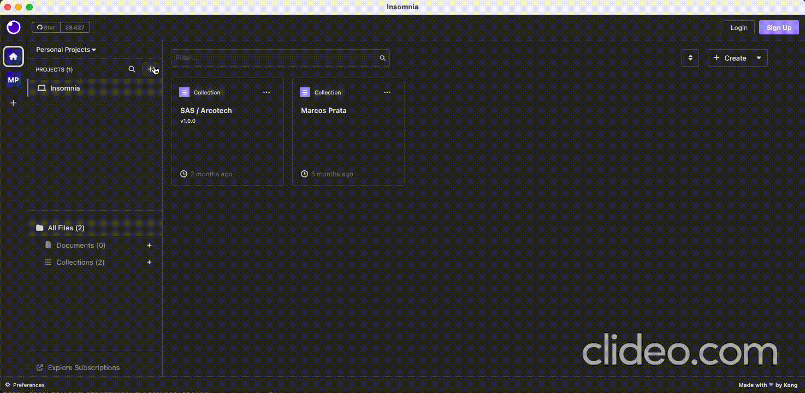

# fiap-lanchonete-api

## 📋 Descrição

API Responsável pela gestão de pedidos de uma lanchonete, envolvendo desde a realização do pedido pelo cliente
até o preparo do pedido pela cozinha.

Os seguintes repositórios também fazem parte desse projeto:

> [fiap-lanchonete-terraform](https://github.com/MarcosPrata/fiap-lanchonete-terraform) - Reponsável por provisionar a infra na AWS.

> [fiap-lanchonete-lambda-authorizer](https://github.com/MarcosPrata/fiap-lanchonete-lambda-authorizer) - Reponsável por autenticar e autorizar as chamadas requests dos usuários.

## 🚦Pre-requisitos

- **Kotlin** versão 1.4.10
- **Docker**
- **Gradle** versão 6.6.1
- **Java** 17 ou superior
- **Kubectl** versão 5.0.1 ou superior

## 🚀 Quick Start
- Rodar usando o Docker: 
    - Execute o comando para subir os container do Postgres.
        - `$ docker-compose up`
    - Ou clique no botão abaixo
      - `gradlew up`
    - Lembre-se de ter as portas 5432(postgres) e 80(aplicação) disponíveis!

- Rodar usando o Gradle
  - Caso rode usando o gradle é necessário iniciar o banco manualmente ou utilizando:
    - `$ docker-compose run postgres`
  - Use o comando abaixo:
      - `gradlew bootRun`
  - Ou pela própria IDE
    - Indo no arquivo LanchoneteApplication.kt e clicando no simbolozinho de play.

## ☁️ Deploy usando kubernetes
- Habilite a opção de kubernetes no docker
    - Usando o docker desktop vá em configurações => kubernetes => enable hubernetes
    - Execute os seguintes comando para vincular o docker
        - `$ kubectl config get-contexts`
        - `$ kubectl config use-context docker-desktop`
- Subir o postgres da aplicação
    - Execute os seguintes comandos para subir
        - `$ kubectl apply -f kubernetes/postgres/postgres-secrets.yaml`
        - `$ kubectl apply -f kubernetes/postgres/postgres-config.yaml`
        - `$ kubectl apply -f kubernetes/postgres/postgres-deployment.yaml`
        - `$ kubectl apply -f kubernetes/postgres/postgres-svc.yaml`
- Subir a instancia da aplicação
    - Execute os seguintes comandos para subir
        - `$ kubectl apply -f kubernetes/lanchonete-deployment.yaml`
        - `$ kubectl apply -f kubernetes/lanchonete-svc.yaml`
- Agora para visualizar os pods execute o seguinte comando:
    - `$ kubectl get pods`

## ⚙️ Variáveis de Ambiente
> **ACTIVE_PROFILE** { default: develop }

> **DB_URL** { default: jdbc:postgresql://localhost:5432/lanchonete }
> 
> **DB_USER** { default: postgres }
> 
> **DB_PASSWORD** { default: postgres }

## 💻 Insomnia Collections

1 — Crie um projeto no insomnia ou selecione um já existente

2 — Crie um documento no projeto selecionado com a opção git clone, faça ‘login’ no git caso necessário e adicione o link do repositório

3 — Após isso as collections já estarão disponíveis na aba debug

## 🎓 Integrantes / Devs

> Nome: Marcos Henrique Prata Junior 
> 
> Matrícula: RM349949
> 
> 
> 

> Nome: Marcos Moreira
>
> Matrícula: RM349544
>
> 
> 

> Nome: Marcelo Gonçalves de Barros
>
> Matrícula: RM349535
>
> 
> 

> Nome: Henrique de Paula Leite
>
> Matrícula: RM350046
>
> 
> 
